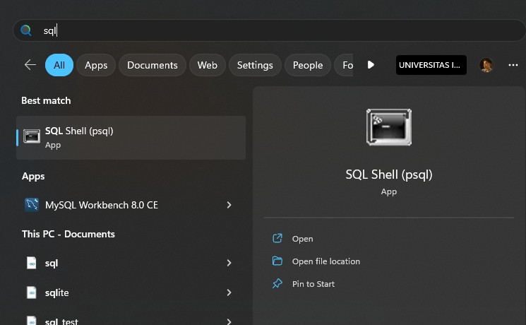
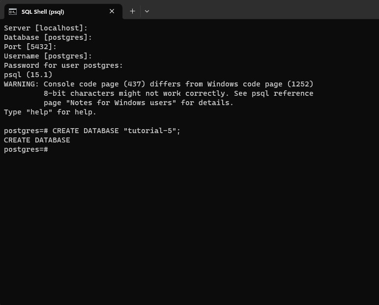
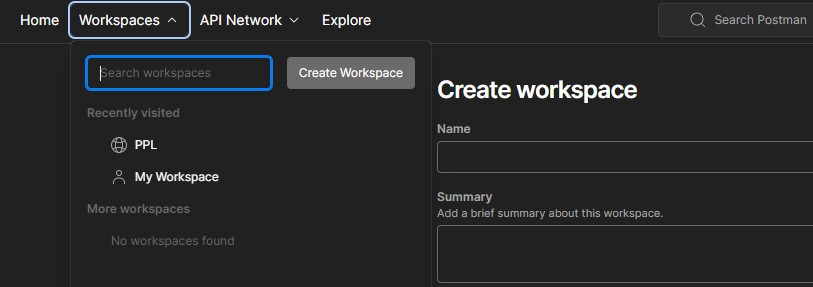
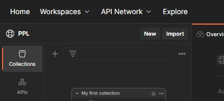
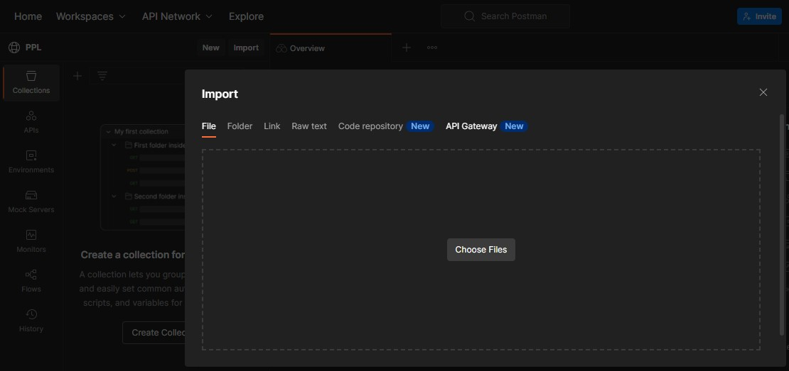
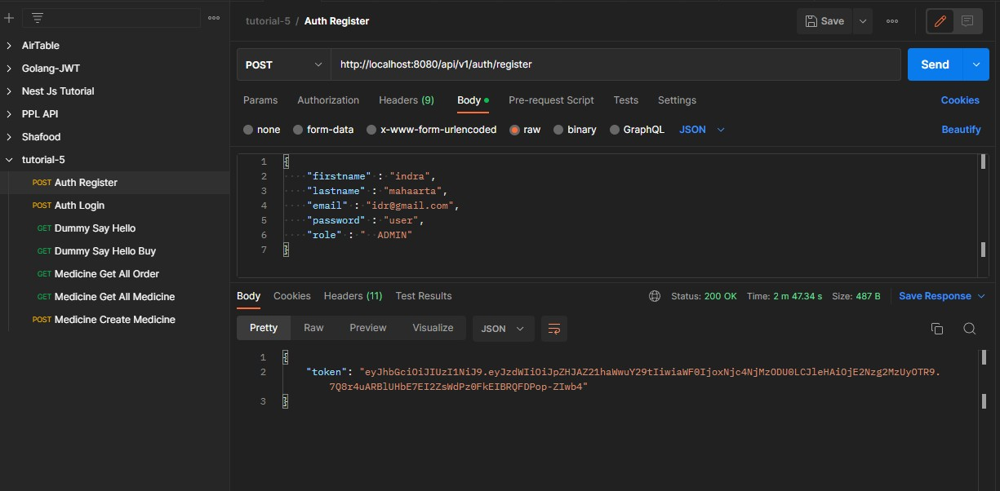
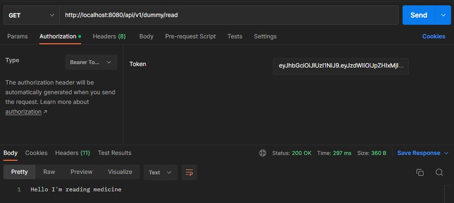

# Tutorial 5
Pada sesi tutorial-4 kemarin, kamu sudah berhasil menerapkan dua buah design pattern, yaitu Abstract Factory dan Singleton. Pada sesi tutorial-5 ini, kamu akan menerapkan hal yang sudah kamu pelajari minggu ini diluar design pattern, yaitu MVC dan REST.

## MVC dan REST
- **APOTEK AKU WARAS**, tertarik dan ingin meminta tolong kepada kamu untuk membuat layanan sistem informasi apoteknya.
- Karena **APOTEK AKU WARAS** belum pernah membuat web sebelumnya, kamu diminta untuk membuat API service terlebih dahulu
- **APOTEK AKU WARAS** kemudian menjelaskan lebih rinci layanan sistem informasi apotek yang dibutuhkannya sebagai berikut:
  - Terdapat 2 role pengguna dalam aplikasi, yaitu **Admin** dan **User**. 
  - **User** dapat membuat pesanan terhadap obat yang tersedia di apotek
  - **Admin** memiliki otorisasi untuk membuat, melihat, mengupdate, dan menghapus obat yang tersedia di apotek. Selain itu, **Admin** juga dapat melihat, mengupdate, dan menghapus pesanan yang telah dibuat oleh **User**.


## MVC Layer pada Spring Boot
### Model
Model merupakan layer pada arsitektur MVC yang berperan untuk mengatur bisnis logic dari aplikasi. Selain itu, layer ini juga berperan dalam menyiapkan, mengatur, dan mengorgasisasikan data. 

Pada Spring boot, bagian yang merepresentasikan layer Model adalah service, repository, dan model, karena ketiga bagian inilah yang akan menentukan bagaimana data akan diolah maupun disimpan. 

Berikut adalah contoh code yang merupakan bagian dari layer Model
```
@Data
@Builder
@NoArgsConstructor
@AllArgsConstructor
@Entity
public class Medicine {
    @Id
    @GeneratedValue
    private Integer id;
    private String name;
    ...
}
```

```
@Repository
public interface MedicineRepository extends JpaRepository<Medicine, Integer> {
    @NonNull
    List<Medicine> findAll();
    ...
} 
```
``` 
@Service
@RequiredArgsConstructor
public class MedicineServiceImpl implements MedicineService {
    private final MedicineRepository medicineRepository;
    @Override
    public List<Medicine> findAll() {
      ...
    }
    ...
}
```

## View
View adalah layer yang berperan untuk menampilkan dan memvisualisasikan data pada aplikasi. Agar dapat ditampilkan maupun divisualisasikan, data tersebut haruslah terlebih dahulu tersedia. Oleh karena itu, layer View akan melakukan request ke controller agar dapat memperoleh response berisikan data yang diinginkan.   

Dalam tutorial kali ini, kamu tidak akan berinteraksi dengan view karena kita akan menggunakan Postman untuk dapat melakukan request dan menerima response dari aplikasi.   

## Controller
Controller merupakan bagian yang berperan untuk menjembatani layer View dan juga layer Model. Controller akan menerima sebuah *request* dari View, meneruskannya ke layer Model, dan mengirimkan *response* dari hasil pengolahan di layer Model

Pada Spring boot, Layer ini ditandai dengan anotasi `@Controller` atau `@RestController`.  

```
@RestController
@RequestMapping("/api/v1/medicine")
@RequiredArgsConstructor
public class MedicineController {
    private final MedicineService medicineService;

    @GetMapping("/all")
    @PreAuthorize("hasAuthority('medicine:read')")
    public ResponseEntity<List<Medicine>> getAllMedicine() {
      ...
    }
    
    ...
}
```

## JPA Repository
Pada tutorial kali ini, kamu akan menggunakan database sebagai tempat penyimpanan data. Spesifiknya, kamu akan menggunakan bantuan **JPA Repository** untuk dapat berinteraksi dengan database.

JPA Repository merupakan sebuah *Object-Relational Mapping* (ORM) pada Spring yang memudahkan kita untuk dapat memanipulasi data pada database menggunakan paradigma berorientasi objek. Artinya, kita cukup menggunakan fungsi bawaan JPA Repository ataupun mendefinisikan fungsi kita sendiri tanpa perlu membuat _query_ secara manual.

```
@Data
@Builder
@NoArgsConstructor
@AllArgsConstructor
@Entity
@Table(name = "_user")
public class User implements UserDetails {

    @Id
    @GeneratedValue
    private Integer id;
    private String firstname;
    private String lastname;

    private String password;

    @Column(unique=true)
    private String email;

…
```

```
@Repository
public interface MedicineRepository extends JpaRepository<Medicine, Integer> {
    @NonNull
    List<Medicine> findAll();
    @NonNull
    Optional<Medicine> findById(@NonNull Integer id);
    void deleteById(@NonNull Integer id);
}
```

### Penjelasan anotasi:
| Anotasi | Penjelasan                                                                                                                                                                    |
| --------|-------------------------------------------------------------------------------------------------------------------------------------------------------------------------------|
| `@Entity` | Digunakan untuk menyatakan bahwa class ini nantinya akan disimpan dalam database.                                                                                             |  
| `@Table()` | Digunakan untuk mendefinisikan detail dari table yang akan disimpan. Misalnya, kita bisa mengatur nama table dengan @Table(name = "nama_table").                              |
| `@NoArgsConstructor` | Digunakan untuk membuat konstraktor tanpa parameter                                                                                                                           |
| `@AllArgsConstructor` | Digunakan untuk membuat konstraktor yang berisikan parameter berupa seluruh attribute dari suatu class                                                                        |
| `@Column()` | Digunakan untuk menspesifikasikan detail dari kolom yang akan dibuat. Misalnya dalam hal ini, kita bisa mendefinisikan nama dalam suatu kolom yang akan disimpan ke database. |
| `@GeneratedValue()` | Memberi tahu bahwa atribut ini akan diisi secara otomatis ketika memasukkan ke database                                                                                       |

Untuk membuat repositori, cukup buat bean `@Repository` yang extends `JpaRepository`. Nantinya `MedicineRepository` sudah dapat digunakan dengan melakukan `@Autowire` ke service-service yang membutuhkannya.

### Konfigurasi Database
Ketika menggunakan database, kamu perlu melakukan konfigurasi pada berkas `resources/application.properties`. Berikut adalah konfirgurasinya
```
spring.datasource.url=jdbc:postgresql://localhost:5432/tutorial-5
spring.datasource.username=postgres
spring.datasource.password=postgres
spring.datasource.driver-class-name=org.postgresql.Driver
spring.jpa.show-sql=true
spring.jpa.hibernate.ddl-auto=create-drop
spring.jpa.properties.hibernate.format_sql=true
spring.jpa.database-platform=org.hibernate.dialect.PostgreSQLDialect
spring.security.user.name=admin
spring.security.user.password=Sena123
```

Atribut `spring.datasource` mengatur jenis (PostgreSQL, MongoDB, H2) dan credentials (`username`, `password`, nama database) dari DBMS yang digunakan, sedangkan spring.jpa mengatur setting khusus JPA. Lalu, konfigurasi `spring.jpa.hibernate.ddl-auto=create-drop` akan membuat skema saat startup dan menghapus seluruh data pada skema saat aplikasi dihentikan. Silahkan melakukan eksplorasi tentang ini jika tertarik, tetapi di tutorial-5 kamu belum perlu mengubah `application.properties`.

Tutorial ini akan menggunakan **PostgreSql** sebagai databasenya. Silahkan download PostgreSQl pada link [berikut](https://www.postgresql.org/download/).

Untuk dapat menjalankan program, kaliah harus membuat databasenya terlebih dahulu. Berikut adalah cara membuat database di postgresql:
- Buka SQLShell
  
- Masukkan credential DBMS kamu masing- masing
- Eksekusi ```CREATE DATABASE "tutorial-5"``` untuk membuat database
  

Selain cara diatas, alternatif lain yang bisa kamu gunakan untuk mengakses PostgreSql adalah dengan menggunakan command `psql -U postgres -h localhost` pada terminal kamu.

## Postman
Karena aplikasi tidak memiliki web, tentu susah untuk membuat request yang memerlukan data, seperti POST dan PUT. Postman adalah sebuah software yang dapat membantu kita dalam melakukan pemanggilan API. Pada Postman kamu dapat mengirimkan request ke aplikasi kamu. Postman mendukung segala jenis request, seperti GET, POST, PUT, dan DELETE.

Berikut [Postman collection](https://api.postman.com/collections/26272020-1eb8c672-c607-44c3-b42c-f143c3cb1a4e?access_key=PMAT-01GVCKCX9AB20KN0HHJ3SE0Y2M) yang dapat kamu import untuk mencoba pemanggilan API pada Tutorial kali ini. Silahkan download file berikut.

### Panduan Menggunakan Postman:
- Download [Postman](https://www.postman.com/downloads/) atau gunakan Postman[ API Platform](https://www.postman.com/). Lalu sign up/Login
- Buat sebuah workspace
  
- Klik Import > Link, kemudian Paste link collection yang telah disediakan, kemudian klik continue
  
  
- Kemudian ulangi langkah diatas untuk mengimport postman environtment . Namun, ketika mengimport postman environtment, pilih raw text. Berikut adalah raw text dari postman environtment yang bisa kamu gunakan
```
{
	"id": "25c7f3d7-704e-43a3-b57f-383b6e8993ad",
	"name": "Tutorial 5",
	"values": [
		{
			"key": "url",
			"value": "localhost:8080/api/v1",
			"type": "default",
			"enabled": true
		},
		{
			"key": "TOKEN",
			"value": "",
			"type": "default",
			"enabled": true
		}
	],
	"_postman_variable_scope": "environment",
	"_postman_exported_at": "2023-03-13T04:29:12.077Z",
	"_postman_exported_using": "Postman/10.11.2"
}
```
- Setelah berhasil mengimport postman colletion dan juga environtment ke dalam workspace, kamu bisa mencoba seluruh request yang tersedia.
- Ada beberapa request yang bisa kamu coba, misalnya Register User pada folder `Auth/User` yang akan mengirimkan request dengan method **POST**  ke endpoint ````/api/v1/auth/register````. Silakan pilih request tersebut lalu isikan request body yang dibutuhkan untuk register, kemudian send.
- Setelah kamu mengeksekusi request tersebut, aplikasi akan mengirimakn response berupa JWT token akan ditampilkan pada bagian response.
  
>Notes:
>Pada tutorial ini, sistem auth akan menggunakan JWT(JSON Web Token). JWT sendiri merupakan sebuah standar yang digunakan untuk membagikan informasi secara aman diantara 2 pihak.
- Lalu coba lihat request Get All Medicine pada folder Medicine.
- Jika kamu mengklik header request tersebut, kamu bisa melihat pasangan Key Value berupa Authorization dengan value Bearer **[token kamu]**. Token tersebut adalah token yang sama seperti yang kamu dapatkan ketika register tadi. Dengan token tersebut kamu dapat mengakses endpoint manapun sesuai dengan authoritas yang kamu miliki
- Setelah itu, Klik send request
- Bisa dilihat bahwa kamu akan mendapatkan respon kosong dengan ```status code 200```
- Selamat, kamu telah berhasil mengakses enpoint **Get All Medicine**. Dengan token tersebut, kamu sekarang dapat mencoba mengakses endpoint lain :)
  
- Silahkan lakukan eksplorasi untuk request lain yang disedikan.


## Requirements
- Lengkapi ```MedicineController.java``` pada method getAllMedicine, getMedicineById, addMedicine, putMedicine, deleteMedicine
- Lengkapi ```OrderController.java``` pada method getAllOrder, getAllUserOrder, createOrder, updateOrder, dan deleteOrder
- Lengkapi ```MedicalServiceImpl.java``` pada method findAll, findById, create, update, delete
- Lengkapi ```OrderServiceImpl.java``` pada method create, update, dan delete